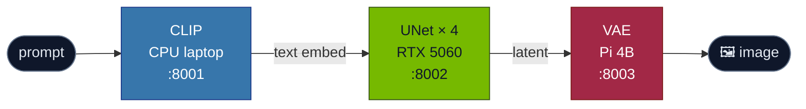

<div align="center">

# SwarmGen

### Distributed Stable Diffusion Turbo across three heterogeneous edge devices


</div>

---

## 🌐 What it does

SwarmGen partitions the Stable Diffusion Turbo pipeline by stage, then pins each
stage to the device best suited to it. The Pi cannot fit the full model in 4 GB
of RAM, so the swarm makes the pipeline reachable on a hardware mix where no
single device could run it alone.



---

## 🎯 Research question

> Can a diffusion pipeline be partitioned across heterogeneous edge devices
> such that **(a)** the system runs end to end, **(b)** peak per-device memory
> drops below what any single device would need, **(c)** the system degrades
> gracefully when a device fails, and **(d)** batch throughput scales with
> swarm size?

The single-GPU baseline wins on single-image latency and the project is honest
about that. The swarm wins on **reachability** (Pi cannot run the full model
alone), **fault tolerance** (a dying worker is detected over heartbeat and the
stage migrates), and **batch throughput** (pipeline parallelism amortizes
latency over a batch).

---

## 📂 Repository layout

| File / dir | Role | Lives on |
| :--- | :--- | :--- |
| 🔌 `protocol.py`     | Tensor wire format. JSON header + raw bytes, no `pickle`. | shared |
| ⚙️ `worker.py`       | Role-flagged FastAPI worker. Same binary on every device.  | all 3 |
| 🧠 `coordinator.py`  | mDNS discovery, async orchestration, heartbeats, fault recovery, batch. | any |
| 📏 `baseline.py`     | Single-device SD-Turbo baseline for the latency comparison. | GPU |
| 🧪 `eval.py`         | Measurement harness. Writes CSVs to `results/`. | any |
| 📈 `plot_results.py` | Builds the figures from `results/*.csv`. | any |
| 🌐 `api.py`          | FastAPI server backing the Tailwind frontend. | any |
| 💻 `static/`         | Tailwind frontend served by `api.py`. | any |
| 🪟 `ui.py`           | Older Gradio demo, kept for reference. | any |
| 📦 `requirements-*.txt`, `setup_*.sh` | Per-device dependencies and bootstrap scripts. | per device |

---

## 🚀 Running the swarm

Three terminals, one per device.

### 🟩 1. GPU desktop &nbsp;·&nbsp; Windows 11, conda env `ml`

```bash
conda activate ml
pip install -r requirements-gpu.txt
python protocol.py                          # tensor round-trip self-check
python worker.py --role unet --port 8002
```

### 🟦 2. CPU laptop

```bash
bash setup_laptop.sh
source .venv/bin/activate
python worker.py --role clip --port 8001
```

### 🟥 3. Raspberry Pi 4B

```bash
bash setup_pi.sh
source .venv/bin/activate
python worker.py --role vae --port 8003
```

### 🟨 4. Coordinator &nbsp;·&nbsp; any device on the LAN

Single image:

```bash
python coordinator.py --prompt "a cat astronaut riding a horse"
```

Web UI:

```bash
python api.py --workers clip@<laptop-ip>:8001,unet@<gpu-ip>:8002,vae@<pi-ip>:8003
# open http://localhost:7860
```

> 💡 Every script supports `--help`.

---

## 📊 Reproducing the measurements

```bash
python eval.py --suite all          # writes results/*.csv
python plot_results.py              # writes figures to outputs/
```

---

## 🧭 Conventions

- 🚫 **No `pickle` on the wire.** Tensors travel as JSON header + raw bytes (see `protocol.py`).
- 📣 **Workers fail loudly.** Heartbeats and structured logs are the only way the coordinator learns about failures.
- 🍓 **The Pi cannot run the full pipeline alone.** That is the premise, not a bug.

---

<div align="center">

### 👥 Authors

**Sudarshan Sridhar** &nbsp;·&nbsp; **Varun Patel**
CIS 589 &nbsp;·&nbsp; Winter 2026 &nbsp;·&nbsp; University of Michigan-Dearborn

</div>
